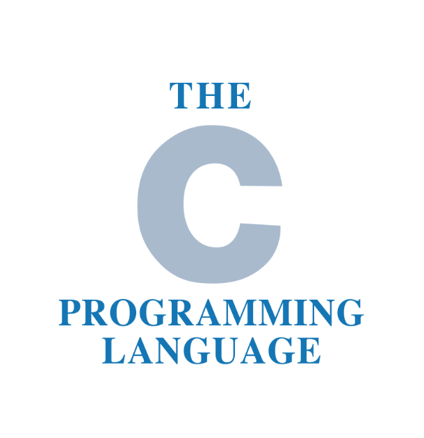
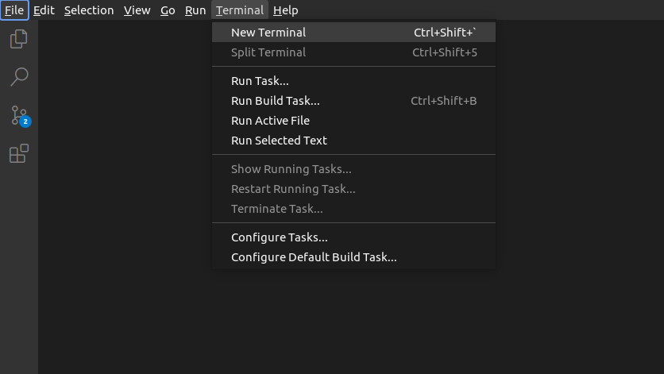

# C Tutorial #



# What is C?
- C is a general-purpose programming language created by Dennis Ritchie at the Bell Laboratories in 1972.

- It is a very popular language, despite being old.

- C is strongly associated with UNIX, as it was developed to write the UNIX operating system.

# Why Learn C?
- It is one of the most popular programming language in the world.
- If you know C, you will have no problem learning other popular programming languages such as Java, Python, C++, C#, etc, as the syntax is similar.
- C is very fast, compared to other programming languages, like Java and Python.
- C is very versatile; it can be used in both applications and technologies
Difference between C and C++
- C++ was developed as an extension of C, and both languages have almost the same syntax.
- The main difference between C and C++ is that C++ support classes and objects, while C does not.

- **For more visit: [C (programming language)](https://en.wikipedia.org/wiki/C_(programming_language))**


# Get Started With C
To start using C, you need two things:

- A text editor, like Notepad, to write C code.
- A compiler, like GCC, to translate the C code into a language that the computer will understand.
There are many text editors and compilers to choose from. In this tutorial, we will use an IDE (see below).

# Install IDE
- An IDE (Integrated Development Environment) is used to edit AND compile the code.

- Popular IDE's include Code::Blocks, Eclipse, and Visual Studio. These are all free, and they can be used to both edit and debug C code.

- Note: Web-based IDE's can work as well, but functionality is limited.

- We will use `vscode` in our tutorial, which we believe is a good place to start.

- You can find the latest version of vscode at https://code.visualstudio.com/download.


# C Quickstart
### Let's create our first C file.

#### Add hello world source code file
- Open vscode 
- In the File Explorer title bar, select New File and name the file helloworld.c


- Write the following C code and save the file as myfirstprogram.c (File > Save File as):

> myfirstprogram.c
```c
#include <stdio.h>

int main() {
  printf("Hello World!\n");
  return 0;
}
```
- open terminal



- run this command
```bash
$ gcc helloworld.c -o a.out && ./a.out
```
> output 
```text
Hello World!
```

# Output (Print Text)
- To output values or print text in C, you can use the printf() function:

## Example
```c
#include <stdio.h>

int main() {
  printf("Hello World!");
  return 0;
}
```

- You can use as many printf() functions as you want. However, note that it does not insert a new line at the end of the output:

## Example
```c
#include <stdio.h>

int main() {
  printf("Hello World!");
  printf("I am learning C.");
  return 0;
}
```


# New Lines
- To insert a new line, you can use the \n character:

## Example
```c
#include <stdio.h>

int main() {
  printf("Hello World!\n");
  printf("I am learning C.");
  return 0;
}
```
- You can also output multiple lines with a single printf() function. However, be aware that this will make the code harder to read:

## Example
```c
#include <stdio.h>

int main() {
  printf("Hello World!\nI am learning C.\nAnd it is awesome!");
  return 0;
}
```
- **Tip:** Two `\n` characters after each other will create a blank line:

## Example
```c
#include <stdio.h>

int main() {
  printf("Hello World!\n\n");
  printf("I am learning C.");
  return 0;
}
```


# C Variables
- Variables are containers for storing data values.

- In C, there are different types of variables (defined with different keywords), for example:

- int - stores integers (whole numbers), without decimals, such as 123 or -123
- float - stores floating point numbers, with decimals, such as 19.99 or -19.99
- char - stores single characters, such as 'a' or 'B'. Char values are surrounded by single quotes
- Declaring (Creating) Variables
- To create a variable, specify the type and assign it a value:

## Syntax
`type variableName = value;`

- Where type is one of C types (such as int), and variableName is the name of the variable (such as x or myName). The equal sign is used to assign a value to the variable.

So, to create a variable that should store a number, look at the following example:

### Example
Create a variable called myNum of type int and assign the value 15 to it:
```c
 int myNum = 15;
```

You can also declare a variable without assigning the value, and assign the value later:

### Example
```c
int myNum;
myNum = 15;
```
Note: If you assign a new value to an existing variable, it will overwrite the previous value:

### Example
```c
int myNum = 15;  // myNum is 15
myNum = 10;  // Now myNum is 10
```
Output Variables
You learned from the output chapter that you can output values/print text with the `printf()` function:

### Example
```c
printf("Hello World!");
```

In many other programming languages (like Python, Java, and C++), you would normally use a print function to display the value of a variable. However, this is not possible in C:

### Example
```c

int myNum = 15;
printf(myNum);  // Nothing happens
```
- To output variables in C, you must get familiar with something called **format specifiers**.

## Format Specifiers
- Format specifiers are used together with the printf() function to tell the compiler what type of data the variable is storing. It is basically a placeholder for the variable value.

- A format specifier starts with a percentage sign %, followed by a character.

> For example, to output the value of an int variable, you must use the format specifier %d or %i surrounded by double quotes, inside the printf() function:

### Example
```c
int myNum = 15;
printf("%d", myNum);  // Outputs 15
```
- To print other types, use %c for char and %f for float:

### Example
```c
// Create variables
int myNum = 5;             // Integer (whole number)
float myFloatNum = 5.99;   // Floating point number
char myLetter = 'D';       // Character

// Print variables
printf("%d\n", myNum);
printf("%f\n", myFloatNum);
printf("%c\n", myLetter);
```
- To combine both text and a variable, separate them with a comma inside the printf() function:

### Example
```c
int myNum = 5;
printf("My favorite number is: %d", myNum);
```
- To print different types in a single printf() function, you can use the following:

### Example
```c
int myNum = 5;
char myLetter = 'D';
printf("My number is %d and my letter is %c", myNum, myLetter);
```
You will learn more about Data Types in the next chapter.

Add Variables Together
- To add a variable to another variable, you can use the + operator:

### Example
```c
int x = 5;
int y = 6;
int sum = x + y;
printf("%d", sum);
```

Declare Multiple Variables
- To declare more than one variable of the same type, use a comma-separated list:

### Example
```c
int x = 5, y = 6, z = 50;
printf("%d", x + y + z);
```
You can also assign the same value to multiple variables of the same type:

### Example
```c
int x, y, z;
x = y = z = 50;
printf("%d", x + y + z);
```

C Variable Names
All C variables must be identified with unique names.

These unique names are called identifiers.

Identifiers can be short names (like x and y) or more descriptive names (age, sum, totalVolume).

Note: It is recommended to use descriptive names in order to create understandable and maintainable code:

### Example
```c

// Good
int minutesPerHour = 60;

// OK, but not so easy to understand what m actually is
int m = 60;
```