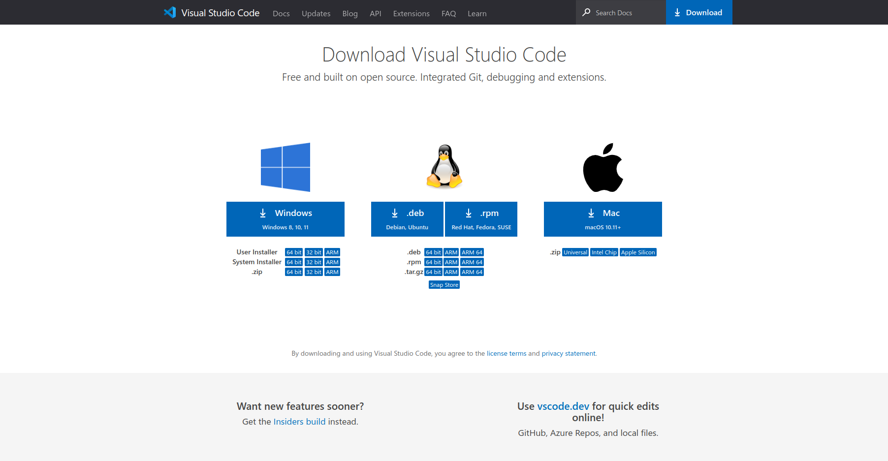

# C Tutorial #


# What is C?
- C is a general-purpose programming language created by Dennis Ritchie at the Bell Laboratories in 1972.

- It is a very popular language, despite being old.

- C is strongly associated with UNIX, as it was developed to write the UNIX operating system.

# Why Learn C?
- It is one of the most popular programming language in the world.
- If you know C, you will have no problem learning other popular programming languages such as Java, Python, C++, C#, etc, as the syntax is similar.
- C is very fast, compared to other programming languages, like Java and Python.
- C is very versatile; it can be used in both applications and technologies
Difference between C and C++
- C++ was developed as an extension of C, and both languages have almost the same syntax.
- The main difference between C and C++ is that C++ support classes and objects, while C does not.

- **For more visit: [C (programming language)](https://en.wikipedia.org/wiki/C_(programming_language))**


# Get Started With C
To start using C, you need two things:

- A text editor, like Notepad, to write C code.
- A compiler, like GCC, to translate the C code into a language that the computer will understand.
There are many text editors and compilers to choose from. In this tutorial, we will use an IDE (see below).

# Install IDE
- An IDE (Integrated Development Environment) is used to edit AND compile the code.

- Popular IDE's include Code::Blocks, Eclipse, and Visual Studio. These are all free, and they can be used to both edit and debug C code.

- Note: Web-based IDE's can work as well, but functionality is limited.

- We will use `vscode` in our tutorial, which we believe is a good place to start.

- You can find the latest version of vscode at https://code.visualstudio.com/download.




# C Quickstart
### Let's create our first C file.

#### Add hello world source code file
- Open vscode 
- In the File Explorer title bar, select New File and name the file helloworld.c


- Write the following C code and save the file as myfirstprogram.c (File > Save File as):

> myfirstprogram.c
```c
#include <stdio.h>

int main() {
  printf("Hello World!\n");
  return 0;
}
```
- open terminal


- run this command
```bash
$ gcc helloworld.c -o a.out && ./a.out
```
> output 
```bash
Hello World!
```