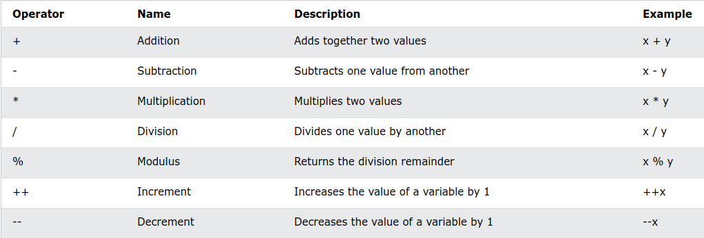
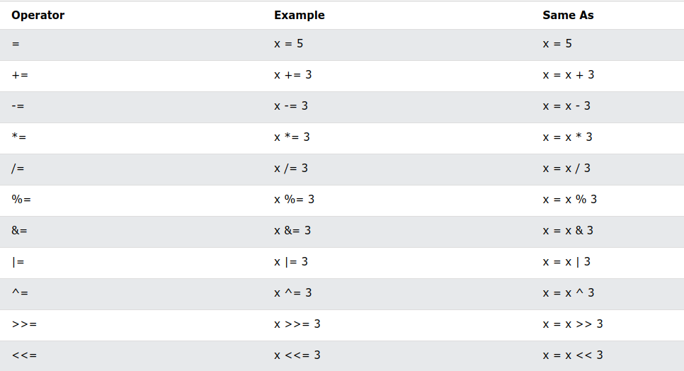
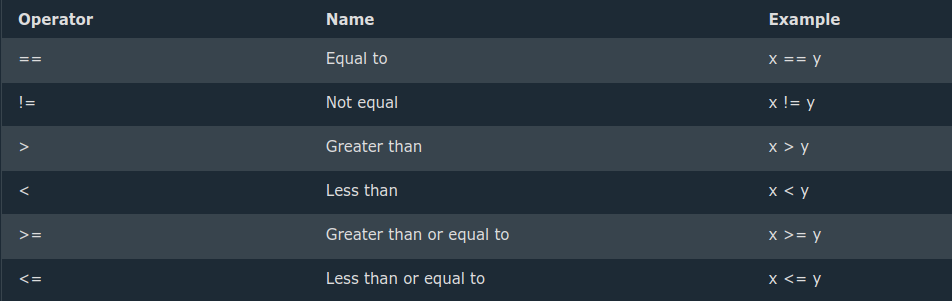
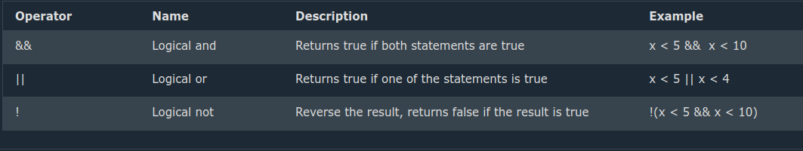

# Operators
- Operators are used to perform operations on variables and values.

- In the example below, we use the + operator to add together two values:

### Example
```c
int myNum = 100 + 50;
```

- Although the + operator is often used to add together two values, like in the example above, it can also be used to add together a variable and a value, or a variable and another variable:

### Example
```c
int sum1 = 100 + 50;        // 150 (100 + 50)
int sum2 = sum1 + 250;      // 400 (150 + 250)
int sum3 = sum2 + sum2;     // 800 (400 + 400)
```
- C divides the operators into the following groups:

1. Arithmetic operators
1. Assignment operators
1. Comparison operators
1. Logical operators
1. Bitwise operators
1. Arithmetic Operators

## Arithmetic operators
> Arithmetic operators are used to perform common mathematical operations.



## Assignment operators
Assignment operators are used to assign values to variables.

In the example below, we use the assignment operator (=) to assign the value 10 to a variable called x:


### Example
```c
int x = 10;
```
The addition assignment operator (+=) adds a value to a variable:

### Example
```c
int x = 10;
x += 5;
```
## A list of all assignment operators:


## Comparison Operators
Comparison operators are used to compare two values.

**Note:** The return value of a comparison is either true (1) or false (0).

In the following example, we use the greater than operator (>) to find out if 5 is greater than 3:




### Example
```c
int x = 5;
int y = 3;
printf("%d", x > y); // returns 1 (true) because 5 is greater than 3
```
## A list of all comparison operators:

## Logical Operators
Logical operators are used to determine the logic between variables or values:




Sizeof Operator
The memory size (in bytes) of a data type or a variable can be found with the sizeof operator:

### Example
```c
int myInt;
float myFloat;
double myDouble;
char myChar;

printf("%lu\n", sizeof(myInt));
printf("%lu\n", sizeof(myFloat));
printf("%lu\n", sizeof(myDouble));
printf("%lu\n", sizeof(myChar));
```